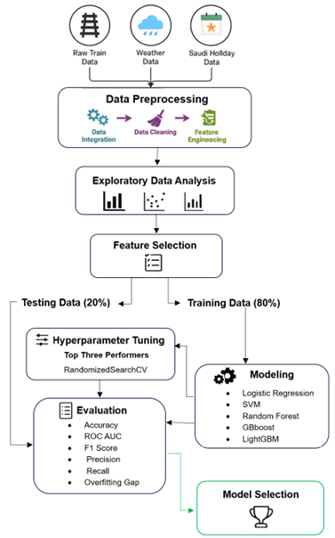
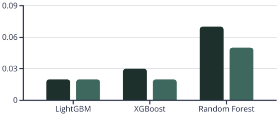

# Predicting-Train-Delays-Saudi-Arabia
*A Data-Driven Machine Learning Approach*

## Overview
This project develops a machine learning–based classification framework to predict whether a train will arrive on time.
The study integrates **operational**, **weather**, and **calendar-based** data to address region-specific delay dynamics and improve predictive reliability.

The work was completed as a Master’s Capstone Project.

---

## Problem Context
Train delays are influenced by complex, non-linear interactions between operational conditions, environmental factors, and temporal patterns.  
Despite global research progress, localized predictive models remain limited, particularly those incorporating climate conditions and public holiday effects.

This project addresses that gap by building a binary delay classification system tailored to the local context. 

---

## Data Sources
The analysis is based on 14,523 train operation records (2023–2024), merged with external contextual data:

- Train operations data
  Journey characteristics, routes, temporal attributes, and delay indicators.

- Weather data (Open-Meteo API)
  Daily temperature, precipitation, wind speed, gusts, and weather codes aligned by date and departure city.

- Saudi holiday calendar
  Binary holiday indicators and categorical vacation types extracted from official academic calendars.

---

## Methodology

The project follows a structured machine learning pipeline:

1. **Data integration & cleaning**
   - Merged multi-source datasets using date and location keys
   - Converted journey time to numerical minutes
   - Direction-based imputation for missing journey durations
   - Mapped weather codes to interpretable categories

2. **Exploratory Data Analysis**
   - Identified class imbalance (majority on-time trains)
   - Analyzed delay behavior by route, season, weather, and holidays

3. **Feature engineering**
   - Weekend indicators
   - Seasonal mapping
   - City-level origin/destination features
   - Cyclical encoding for month, week number, and weekday

4. **Feature selection**
   - Correlation analysis to reduce redundancy
   - Random Forest feature importance
   - Permutation importance with statistical validation

5. **Modeling & tuning**
   - Logistic Regression  
   - Support Vector Machine  
   - Random Forest  
   - XGBoost  
   - LightGBM  

   Top-performing models were optimized using **RandomizedSearchCV** with stratified cross-validation.

---

## Class Imbalance Handling
The target variable (*Right time*) is imbalanced, with on-time trains forming the majority class.

To address this without altering the original data distribution, the project applied cost-sensitive learning, assigning higher penalties to misclassification of delayed trains.  
This improves minority-class detection while preserving real-world operational proportions.

---

## Model Evaluation
Evaluation focused on metrics suitable for imbalanced classification:

- ROC AUC
- F1-score
- Precision & Recall
- Accuracy (reported for completeness)
- Train vs. test ROC AUC gap (overfitting analysis)

**LightGBM (tuned)** achieved the strongest overall performance:
- ROC AUC: **0.9605**
- F1-score: **0.9327**
- Balanced precision–recall trade-off

### Overfitting Assessment

Hyperparameter tuning significantly reduced train–test performance gaps, confirming improved generalization.

---

## Key Insights

- **Journey time** is the most influential predictor of delay likelihood.
- **Temporal patterns** (week, day, season) meaningfully affect punctuality.
- **Weather variables** (wind, precipitation, temperature) contribute distinct predictive value.
- **Holiday and vacation types** elevate delay risk during peak demand periods.

---

## Contact
For any questions, please contact me:

- [LinkedIn](https://www.linkedin.com/in/mashael-alsogair-97b754230/)

Thank you!
